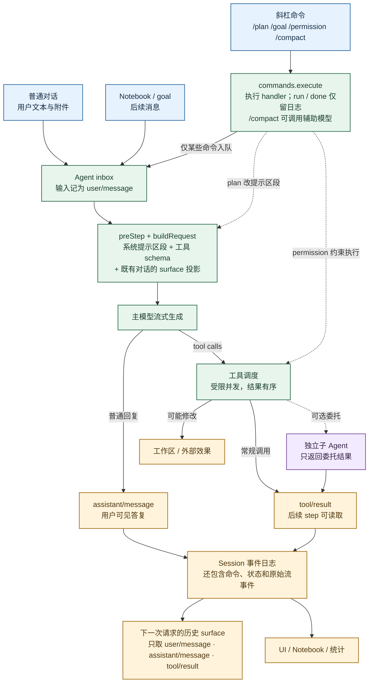

# IntentFlow 输入输出逻辑地图：Agent 循环与命令

普通消息进入 Agent inbox 后，模型请求由系统提示区段、工具 schema 和事件日志的历史 surface 投影组成。斜杠命令先执行 handler：有的只修改状态或权限，有的才会把消息送入 inbox；命令事件本身不直接进入主模型的对话历史。工具结果和历史 surface 在需要继续的下一次请求中使用；图中为了减少回环交叉线，没有画出它们到请求组装节点的返回箭头。虚线表示策略影响或可选委托。

代码入口：`packages/core/agent-loop/src/agent.ts`、`packages/core/session/src/surface.ts`、`packages/interaction/commands/src/index.ts`、`packages/plan/plan-mode/src/index.ts`。
