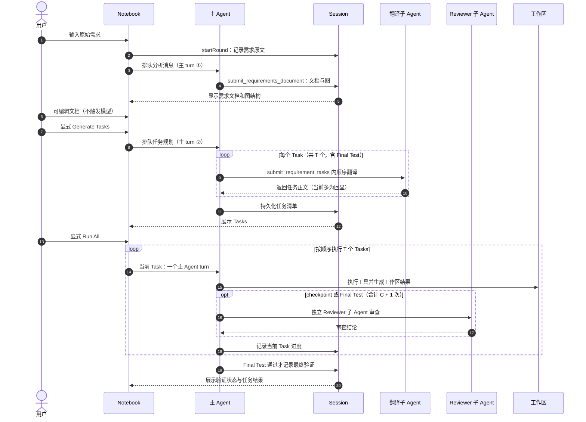

# IntentFlow 输入输出逻辑地图：需求 Notebook 到 Tasks

需求分析、生成任务和运行全部任务由不同的触发动作启动。`T` 是任务总数（含 Final Test），`C` 是 checkpoint 数量；图中的次数表示逻辑调用数量，不等于实际模型请求数，因为每个 Agent turn 仍可包含多个 step 或重试。子 Agent 有独立会话，其产出通过工具结果或审查结论返回；文档、任务清单和审查状态记录在 Session 中，不自动作为原始事件直接进入主模型历史。

代码入口：`packages/session/session-requirements/src/index.ts`。
